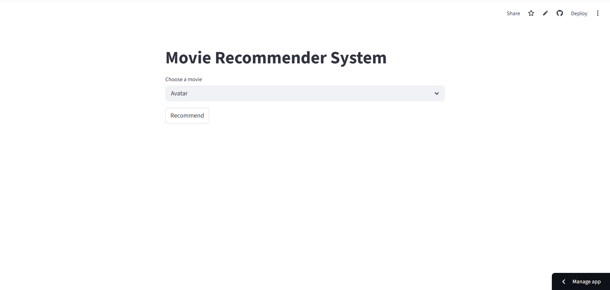
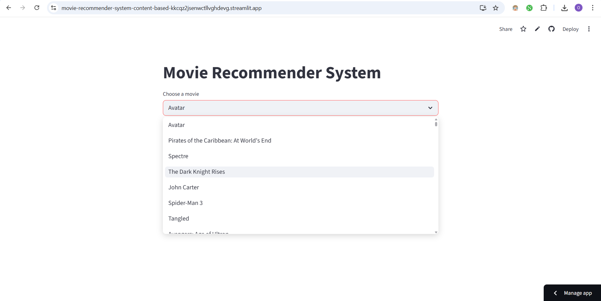

# 🎬 Movie Recommender System (Content-Based)

An AI-powered movie recommendation system that leverages **Natural Language Processing (NLP)** and **Transformer-based embeddings** to capture deep semantic relationships between movies.

🔗 **Live Demo:**
https://movie-recommender-system-content-based-kkcqz2jsenwctllvghdevg.streamlit.app

---

## 📌 Overview

This project builds a **content-based recommendation system** that suggests movies based on their similarity in:

* overview
* Genres
* Keywords
* Cast
* Director

Unlike traditional approaches, this system uses **transformer embeddings** to understand the *meaning* of text rather than just matching words.

---

## 🎯 Problem Statement

Finding movies that match user preferences can be difficult due to the massive number of available options.

This project solves that by:

* Analyzing movie content deeply
* Understanding semantic similarity
* Providing accurate, meaningful recommendations

---

## 🧠 Features

* 🎥 Content-based movie recommendations
* 🧾 Uses multiple features (overview, genres, cast, keywords, director)
* 🤖 Transformer-based text embeddings (not just TF-IDF)
* 📊 Cosine similarity for ranking
* 🌐 Interactive UI built with Streamlit
* ⚡ Fast recommendations using precomputed similarity matrix

---

## 🛠 Tech Stack

### 👨‍💻 Programming Language

* Python

### 📚 Libraries & Tools

* pandas
* numpy
* scikit-learn
* sentence-transformers
* Streamlit
* pickle

### 🤖 Model

* `all-MiniLM-L6-v2` (from SentenceTransformers)

---

## 📊 Dataset

* **Source:** TMDB Movie Metadata (Kaggle)
  https://www.kaggle.com/datasets/tmdb/tmdb-movie-metadata

### 📌 Files Used:

* `movies.csv`
* `credits.csv`

### 📌 Selected Columns:

* `id`
* `title`
* `overview`
* `genres`
* `keywords`
* `cast`
* `crew`

---

## ⚙️ Data Preprocessing

### 1. Merge Datasets

* Joined `movies` and `credits` using:

  * `id` ↔ `movie_id`
  * `title`

---

### 2. Handle Missing Values

* Filled missing `overview` with empty strings

---

### 3. Process JSON Columns

Converted stringified JSON into lists:

* genres → `['Action', 'Adventure']`
* keywords → `['hero', 'villain']`

---

### 4. Feature Engineering

#### 🎭 Cast

* Extracted **top 3 actors only**

#### 🎬 Director

* Extracted from `crew` column

---

### 5. Text Cleaning

* Removed spaces inside names:

  * `"Tom Cruise"` → `"TomCruise"`

✅ This prevents incorrect token splitting during vectorization.

---

### 6. Tag Creation

Combined all features into a single column:

```
tags = overview + genres + keywords + cast + crew
```

---

### 7. Final Dataset

* Kept only:

  * `id`
  * `title`
  * `tags`

---

## 🤖 Model & Recommendation Logic

### Step 1: Text Embeddings

Used transformer model:

```python
SentenceTransformer('all-MiniLM-L6-v2')
```

* Converts each movie into a **numerical vector (embedding)**
* Captures semantic meaning of text

---

### Step 2: Similarity Calculation

* Used **Cosine Similarity**:

```python
from sklearn.metrics.pairwise import cosine_similarity
```

* Output:

  * Similarity matrix of size **(4803 × 4803)**

---

### Step 3: Recommendation Function

```python
def recommend(movie):
    movie_index = movies[movies['title'] == movie].index[0]
    distances = similarity[movie_index]
    movies_list = sorted(list(enumerate(distances)), reverse=True, key=lambda x: x[1])[1:6]
    
    for i in movies_list:
        print(movies.iloc[i[0]].title)
```

---

### ✅ Example Output

Input:

```
Batman Begins
```

Output:

```
The Dark Knight
Batman v Superman: Dawn of Justice
The Dark Knight Rises
Batman
Batman Returns
```

---

## 💾 Model Saving

```python
pickle.dump(movies, open('movies.pkl','wb'))
pickle.dump(similarity, open('similarity.pkl','wb'))
```

---

## 🌐 Deployment

* Deployed using **Streamlit Cloud**

🔗 Live App:
https://movie-recommender-system-content-based-kkcqz2jsenwctllvghdevg.streamlit.app

---

## 📁 Project Structure

```
Movie-Recommender-System/
│
├── app.py
├── Movie Recommender Content Based.ipynb
├── movies.pkl
├── similarity.pkl
├── requirements.txt
├── README.md
├── runtime.txt
├── .gitignore
└── data/
    ├── movies.csv
    └── credits.csv
```

---

## 📸 Screenshots

> *()*

* Home Page UI
* Movie Selection
* Recommendation Results

```



```

---

## 🚀 Installation & Run Locally

```bash
# Clone the repo
git clone https://github.com/your-username/movie-recommender.git

# Navigate to project
cd movie-recommender

# Install dependencies
pip install -r requirements.txt

# Run app
streamlit run app.py
```

---

## 💡 Future Improvements

* Add user-based (collaborative filtering)
* Hybrid recommendation system
* Add movie posters via API
* Improve UI/UX
* Add search suggestions

---

## 👤 Author

**Omar Mohamed**

* GitHub: https://github.com/OmarMoawad1112
* LinkedIn: [www.linkedin.com/in/omar-mowad](http://www.linkedin.com/in/omar-mowad)

---

## ⭐ Final Notes

This project demonstrates:

* Strong understanding of NLP
* Use of Transformer models
* Real-world ML deployment
* Clean data preprocessing pipeline

---

⭐ If you like this project, consider giving it a star!
